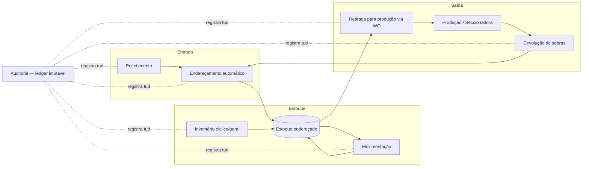

# 01 — Visão Geral

## 1. Contexto e problema

Fábricas de móveis planejados mantêm estoques de chapas (MDF, MDP, compensado, fórmica, fitas de borda em rolos paletizados) de alto valor e alta variedade: dezenas de cores × espessuras × fornecedores. Os problemas típicos que este sistema resolve:

- **Ninguém sabe onde está a chapa.** O operador perde 10–30 min por retirada procurando o pallet certo entre pilhas parecidas (branco TX 15mm vs. branco TX 18mm).
- **Estoque de sistema ≠ estoque físico.** Baixas manuais atrasadas ou esquecidas geram compras erradas e paradas de produção na seccionadora.
- **Retiradas sem controle.** Material sai "para adiantar" sem vínculo com ordem de produção, impossibilitando custeio por projeto e alimentando desvios.
- **Inventário anual traumático.** Fábrica para 1–2 dias para contar tudo, e a acurácia degrada logo depois.

## 2. Objetivos do produto

| # | Objetivo | Métrica de sucesso |
|---|---|---|
| O1 | Localização em tempo real de 100% dos pallets | Acurácia de endereço ≥ 99,5% em contagens cíclicas |
| O2 | Baixa automática no ato físico da retirada | 0 baixas manuais retroativas |
| O3 | Toda saída vinculada a uma Work Order | 100% dos movimentos de saída com `work_order_id` |
| O4 | Operação por operador de empilhadeira sem treinamento extenso | Tarefa completa em ≤ 4 toques + 2 scans; onboarding < 1h |
| O5 | Reduzir tempo de picking | −40% no tempo médio de separação por WO |
| O6 | Prever falta de material antes que pare a produção | Alerta de ruptura com ≥ 7 dias de antecedência (cobertura ≥ 90%) |

## 3. Personas

| Persona | Dispositivo | O que faz no sistema | O que NÃO deve precisar fazer |
|---|---|---|---|
| **Operador de empilhadeira** ("Carlão") | iPad na empilhadeira + scanner | Guardar, mover, retirar, devolver, contar. Só segue instruções na tela e escaneia. | Digitar códigos, escolher endereço manualmente, decidir prioridade |
| **Conferente de recebimento** ("Dona Márcia") | iPad/tablet na doca | Conferir NF × pedido, registrar avarias, criar pallets, imprimir etiquetas | Conhecer o layout do armazém |
| **Supervisor de logística** ("Rodrigo") | Desktop/notebook | Painel de tarefas, exceções, aprovação de ajustes de inventário, cadastros | Operar empilhadeira |
| **PCP / Programador de produção** | Desktop (ERP + WMS) | Libera WOs, acompanha cobertura de material, pedidos extras | Controlar endereços |
| **Comprador** | Desktop | Recebe alertas de ruptura prevista, confere divergências de recebimento | — |
| **Administrador / TI** | Desktop | Usuários, papéis, planta baixa, integração ERP, parametrização | — |

## 4. Princípios de UX (inegociáveis)

1. **Uma decisão por tela.** Cada tela do iPad tem uma pergunta e uma ação primária. Nunca formulários longos.
2. **Botões gigantes.** Alvo de toque mínimo 80×80 pt para ações primárias; fonte ≥ 22 pt; operável com luva.
3. **Scan substitui digitação.** Toda identificação (pallet, endereço, WO) entra por leitura de QR/DataMatrix. Digitação manual é fallback escondido atrás de "Não consigo escanear".
4. **Fluxo guiado (wizard).** O sistema diz o próximo passo; o operador nunca precisa "saber o processo". Barra de progresso sempre visível (`Passo 2 de 4`).
5. **Feedback multissensorial.** Verde + som de acerto + vibração no scan correto; vermelho + som grave no scan errado, com mensagem do que fazer.
6. **Alto contraste, modo luz do dia.** Paleta testada para galpão com portas abertas; dark mode automático para turno noturno.
7. **Tolerante a interrupção.** Toda tarefa pode ser pausada e retomada; o estado vive no servidor, não na sessão do navegador.
8. **Offline não bloqueia.** Sem Wi-Fi, o operador continua escaneando; a fila sincroniza ao reconectar (ver doc 02, seção offline-first).
9. **Texto de gente.** "Leve o pallet para a RUA B, coluna 3, chão" — nunca "Putaway task #4812 pending".

## 5. Processos de negócio (macro)

### 5.1 Recebimento

1. Caminhão chega; conferente abre o recebimento escaneando/selecionando o **pedido de compra** (importado do ERP) ou digitando a chave da NF-e.
2. Sistema mostra os itens esperados. Conferente confere quantidade e estado por item; registra avarias com foto.
3. Para cada grupo de chapas descarregado, o sistema **cria um pallet** (material + quantidade + lote do fornecedor) e **imprime a etiqueta** na térmica da doca.
4. Pallet fica em status `RECEBIDO` na área de doca (endereço virtual `DOCA-01`), gerando automaticamente uma **tarefa de guarda** para a empilhadeira.
5. Divergências (falta, sobra, avaria) geram ocorrência para Compras, sem travar o fluxo físico.

### 5.2 Endereçamento automático (putaway)

1. Operador toca **GUARDAR** no iPad → sistema mostra fila de pallets na doca, priorizada.
2. Operador **escaneia o pallet** → sistema calcula e exibe o **endereço sugerido** + mapa com rota (ver doc 03 para o algoritmo e doc 07 para a versão com IA).
3. Operador leva o pallet, **escaneia a etiqueta do endereço** na posição.
4. Scan bate com a sugestão → confirmado em 1 toque. Scan em endereço diferente mas **válido/livre** → sistema aceita com aviso e re-registra ("override"), pois o físico manda. Endereço ocupado/incompatível → bloqueia com explicação.
5. Estoque passa a `ARMAZENADO` naquele endereço. Tudo vai para o ledger.

### 5.3 Movimentação interna

- Sempre em duplo scan: **scan do pallet na origem → scan do endereço de destino**.
- Pode nascer de: tarefa gerada pelo sistema (reabastecimento de área de picking, re-slotting sugerido pela IA, consolidação) ou movimentação avulsa iniciada pelo operador (que exige motivo em 1 toque: "Liberar posição", "Acesso bloqueado", "Outro").
- Pallet em trânsito fica com endereço `EMPILHADEIRA-{id}` — o mapa mostra que ele está "no garfo".

### 5.4 Retirada para produção (picking) — fluxo central

1. Operador toca **RETIRAR** e **escaneia o QR da Work Order** (impresso na ordem de corte que sai do PCP).
2. Sistema mostra a **lista de materiais** da WO: material, quantidade de chapas, status (reservado / disponível / em falta).
3. Sistema exibe o **mapa da planta com os pallets alocados destacados** e a **rota otimizada** (ver doc 07).
4. Fluxo pallet a pallet: o mapa guia até a posição → operador **escaneia o pallet** → sistema valida (é o pallet certo? é o material certo? FIFO respeitado?) → operador confirma a quantidade retirada (default = quantidade pedida, ajuste por botões grandes − / +).
5. A cada confirmação o **estoque baixa automaticamente**: pallet inteiro consumido → status `CONSUMIDO`, endereço liberado; retirada parcial → saldo do pallet atualizado e pallet segue para a produção ou permanece (parametrizável por fluxo).
6. Ao final, resumo da separação e status da WO muda para `SEPARADA` (ou `PARCIAL` com pendências explícitas).

**Validações do scan de pallet no picking:**
- Pallet não pertence à alocação da WO → vermelho: "Este pallet não é desta ordem. O correto está na RUA C-02, nível 1."
- Pallet correto de material, mas fere FIFO/lote → alerta âmbar com opção "usar mesmo assim" (registrado como exceção, exige motivo).
- Quantidade insuficiente no pallet → sistema realoca o restante em outro pallet na hora e atualiza a rota.

### 5.5 Pedido extra (regra de ouro)

> **Nenhum material sai do estoque sem Work Order.**

- Se a produção precisa de material além do previsto (chapa riscada na seccionadora, erro de corte, peça extra), o solicitante abre um **Pedido Extra** que **referencia obrigatoriamente uma WO existente** e um **motivo tipificado** (`ERRO_CORTE`, `AVARIA_PROCESSO`, `QUALIDADE_MATERIAL`, `AJUSTE_PROJETO`, `OUTRO+texto`).
- O pedido extra pode exigir **aprovação do supervisor** acima de um limite parametrizável (ex.: > 2 chapas ou > R$ X).
- Aprovado, vira uma tarefa de picking normal, vinculada à mesma WO — o custo do extra fica no projeto certo e o motivo alimenta o dashboard de perdas (doc 07).

### 5.6 Devolução

1. Produção devolve sobras (chapas inteiras não usadas ou pallet parcial). Operador toca **DEVOLVER**, **escaneia o pallet** (ou cria um "pallet de sobras" escaneando o material na etiqueta mestre + informando quantidade).
2. Sistema valida contra a última retirada da WO (não se devolve mais do que saiu) e pede o estado do material (`ÍNTEGRO` / `AVARIADO`).
3. Íntegro → volta ao fluxo de endereçamento automático (o sistema tende a sugerir posições de acesso rápido para saldos quebrados, para que sejam consumidos primeiro). Avariado → endereço da área de quarentena/descarte, com ocorrência.
4. Estorno é lançado no ledger vinculado à WO de origem.

### 5.7 Inventário

- **Contagem cíclica dirigida (padrão):** o sistema gera diariamente uma pequena lista de endereços a contar, priorizando itens classe A, endereços com movimentação recente, e **endereços apontados como suspeitos pela detecção de anomalias** (doc 07). Operador vai ao endereço, escaneia a posição, escaneia o(s) pallet(s), confirma/corrige a quantidade. 2–5 min por dia.
- **Inventário geral:** modo bloqueante por zona (congela movimentações da zona), dupla contagem cega para divergências, aprovação de ajustes pelo supervisor.
- **Ajustes:** nunca sobrescrevem — geram movimento `AJUSTE_INVENTARIO` no ledger, com contagem, contador, aprovador e motivo.

### 5.8 Auditoria

- Todo evento de estoque é um registro **imutável e encadeado** em `stock_movements` (nunca UPDATE/DELETE; correção = movimento de estorno).
- Trilha responde: *quem, o quê, quanto, de onde, para onde, quando, por qual motivo, vinculado a qual documento (PO/WO/contagem)*.
- Tela de auditoria permite reconstruir a linha do tempo de **um pallet**, **um endereço**, **um material** ou **uma WO**.
- Exportação CSV assinada para auditoria externa/fiscal.

## 6. Regras de negócio consolidadas

| ID | Regra |
|---|---|
| RN-01 | Todo pallet possui ID único global e etiqueta física (QR + código humano `PLT-000123`). |
| RN-02 | Todo endereço é único, etiquetado fisicamente e existe na planta baixa digital com coordenadas. |
| RN-03 | Um endereço comporta no máximo `capacidade_pallets` pallets (default 1); pallet ocupa exatamente 1 endereço (ou está em doca, garfo, produção ou quarentena — endereços virtuais). |
| RN-04 | Toda saída para produção exige WO ativa; pedido extra exige WO + motivo tipificado (+ aprovação acima do limite). |
| RN-05 | Baixa de estoque acontece no ato do scan de confirmação — nunca manual, nunca retroativa. |
| RN-06 | Consumo segue FIFO por lote de recebimento; exceções exigem confirmação explícita e ficam registradas. |
| RN-07 | `stock_movements` é append-only. Correções são estornos referenciando o movimento original. |
| RN-08 | Divergência de inventário acima do limite parametrizado exige segunda contagem cega + aprovação do supervisor. |
| RN-09 | Reservas de material são criadas na liberação da WO pelo PCP e expiram/liberam conforme parametrização. |
| RN-10 | Material avariado nunca volta ao estoque disponível — vai para quarentena com ocorrência. |

## 7. Fora de escopo (v1)

- Controle de estoque de ferragens/acessórios pequenos (bin picking) — a arquitetura suporta, mas a v1 é focada em chapas paletizadas.
- Roteirização de frota externa / expedição de produto acabado.
- AGVs / empilhadeiras autônomas (o modelo de tarefas já é compatível para o futuro).
- Faturamento/fiscal — o WMS integra com o ERP, não o substitui.
