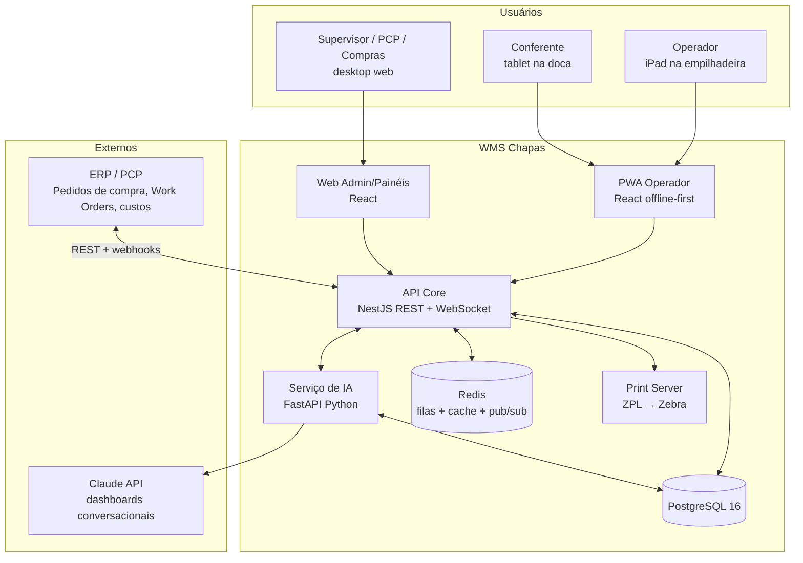

# 02 — Arquitetura de Solução

## 1. Visão de contexto



## 2. Componentes

### 2.1 PWA do operador (iPad)

- **React + TypeScript + Vite**, instalada como PWA (ícone na home do iPad, tela cheia, sem chrome do navegador).
- **Offline-first**: IndexedDB (via biblioteca tipo Dexie) guarda o snapshot de dados de trabalho (tarefas atribuídas, mapa, catálogo de materiais) e uma **fila de eventos de saída** (outbox pattern).
- **Scanner**: câmera do iPad com decodificação local de QR/DataMatrix (biblioteca WASM, ex.: zxing-wasm) **ou** scanner Bluetooth HID acoplado à empilhadeira (o campo de scan aceita entrada de teclado HID de forma transparente).
- **Mapa**: planta baixa renderizada em SVG a partir do JSON de layout (doc 03); pan/zoom por gesto; posições e rota destacadas.
- **Sessão**: login por crachá (scan do QR do crachá) + PIN de 4 dígitos. Troca de operador em 2 toques (multi-turno no mesmo iPad).

### 2.2 API Core (NestJS)

Módulos (alinhados ao domínio, candidatos a bounded contexts):

| Módulo | Responsabilidade |
|---|---|
| `catalog` | Materiais, fornecedores, unidades |
| `layout` | Armazéns, zonas, endereços, planta baixa |
| `inbound` | Pedidos de compra, recebimentos, criação de pallets, etiquetas |
| `inventory` | Pallets, saldos, reservas, **ledger de movimentos** |
| `tasks` | Motor de tarefas (guarda, picking, movimentação, contagem) com fila priorizada por operador/equipamento |
| `outbound` | Work Orders, alocação/reserva, picking, pedidos extras, devoluções |
| `counting` | Contagem cíclica e inventário geral |
| `audit` | Consulta do ledger, trilhas, exportações |
| `integration` | Conectores ERP (import PO/WO, export movimentos), webhooks |
| `iam` | Usuários, papéis, permissões, sessões de dispositivo |

- **REST** para comandos e consultas; **WebSocket** (namespace `/realtime`) para: atualização do mapa, novas tarefas, progresso de WO nos painéis.
- **Transações**: todo comando que altera estoque roda em transação única: valida → grava movimento no ledger → atualiza projeção de saldo (`pallets`, `location_occupancy`) → publica evento no Redis.
- **Idempotência**: todo comando de mutação exige `Idempotency-Key` (UUID gerado no cliente) — essencial para a fila offline reenviar sem duplicar.

### 2.3 Serviço de IA (FastAPI)

Separado da API Core para escalar e evoluir de forma independente (detalhes no doc 07):

- Jobs batch (previsão de ruptura, re-slotting, score de anomalias) agendados via scheduler + fila Redis.
- Endpoints síncronos de baixa latência (sugestão de endereço, otimização de rota de picking) chamados pela API Core com timeout curto e **fallback determinístico** (regras do doc 03) — a operação nunca depende da IA estar no ar.
- Acesso read-only ao PostgreSQL (réplica) + tabelas próprias para saídas de modelo.

### 2.4 Integração com ERP

| Fluxo | Direção | Mecanismo |
|---|---|---|
| Pedidos de compra (itens esperados no recebimento) | ERP → WMS | Webhook ou polling REST; upsert por `po_number` |
| Work Orders liberadas (lista de materiais/BOM de chapas) | ERP/PCP → WMS | Webhook na liberação da ordem de corte; gera reservas |
| Confirmação de recebimento (para financeiro/fiscal) | WMS → ERP | Evento `receipt.completed` |
| Consumos e devoluções por WO (custeio do projeto) | WMS → ERP | Evento `movement.created` filtrado, batch a cada N min |
| Ajustes de inventário | WMS → ERP | Evento com aprovação anexada |

Sem ERP (fase 1 standalone): telas administrativas permitem cadastrar PO e WO manualmente ou importar CSV — os contratos internos são os mesmos.

## 3. Offline-first (detalhe crítico para galpão)

Wi-Fi em galpão com racks de chapa metálica falha. O desenho assume desconexões de segundos a minutos como **normais**.

### 3.1 Estratégia

- **Leitura**: a PWA mantém réplica local de: tarefas atribuídas ao operador, layout/planta, catálogo de materiais e etiquetas ↔ pallets do dia. Sincronização incremental por `sync_token` (cursor por entidade) ao reconectar e a cada N minutos.
- **Escrita (outbox)**: cada ação do operador vira um evento local `{idempotency_key, tipo, payload, created_at}` gravado em IndexedDB **antes** do feedback verde. Um worker envia a fila em ordem; o servidor deduplica pela chave.
- **Validação local**: as validações críticas de scan (pallet esperado? endereço válido?) rodam localmente contra a réplica, então o feedback é instantâneo mesmo offline.
- **Conflitos**: resolvidos no servidor por regra de domínio, não por timestamp. Ex.: dois operadores guardam no mesmo endereço com capacidade 1 → o segundo evento falha, vira **tarefa de correção** para o segundo operador ("Endereço ocupado — leve para B-04-N1"), notificada quando ele reconectar. A UI mostra um selo `⚠ pendente de sincronização` em ações ainda não confirmadas pelo servidor.
- **Relógio**: eventos carimbam `client_ts` e `server_ts`; o ledger ordena por `server_ts`, preservando `client_ts` para análise.

### 3.2 O que NUNCA é permitido offline

- Aprovar ajustes de inventário ou pedidos extras acima do limite.
- Cadastros (materiais, endereços, usuários).
- Fechar inventário geral de zona.

## 4. Modelo de eventos (ledger + pub/sub)

O **ledger `stock_movements` é a fonte da verdade**; saldos são projeções recomputáveis.

Tipos de movimento:

```
RECEBIMENTO          doca ← fornecedor          (+qty, cria pallet)
GUARDA               endereço ← doca/garfo      (muda localização)
TRANSFERENCIA        endereço ← endereço        (muda localização)
SAIDA_PRODUCAO       produção ← endereço        (−qty, exige WO)
DEVOLUCAO            doca/endereço ← produção   (+qty, exige WO de origem)
AJUSTE_INVENTARIO    ±qty                       (exige contagem + aprovação)
QUARENTENA           quarentena ← qualquer      (avaria)
DESCARTE             fora ← quarentena          (−qty, exige aprovação)
ESTORNO              inverso de um movimento    (referencia movement_id)
```

Eventos publicados no Redis (`wms.events.*`) e consumidos por: WebSocket gateway (tempo real nos painéis/mapa), conector ERP, serviço de IA (features online), e trilha de notificações.

## 5. Decisões de arquitetura (ADR resumido)

| # | Decisão | Alternativa rejeitada | Racional |
|---|---|---|---|
| A1 | PWA em vez de app nativo iOS | App nativo Swift | Sem fila de App Store, uma base de código com o painel web, atualização instantânea; câmera+WASM decodifica QR bem o suficiente; scanner BT HID cobre casos de baixa luz |
| A2 | Ledger append-only + projeções | Saldo mutável como verdade | Auditoria nativa, reconstrução de estado, base limpa para IA; custo extra de projeção é trivial neste volume |
| A3 | Monólito modular NestJS | Microserviços desde o início | Time pequeno, um domínio coeso; módulos com fronteiras claras permitem extrair serviços depois (IA já nasce separada) |
| A4 | PostgreSQL para tudo (inclusive fila leve via Redis apenas para pub/sub e jobs) | Kafka/RabbitMQ | Volume de eventos de uma fábrica (milhares/dia) não justifica; menos peças para operar |
| A5 | IA com fallback determinístico | IA no caminho crítico | Empilhadeira não pode parar porque um modelo caiu; sugestão ruim ≠ operação parada |
| A6 | Etiquetas QR (com DataMatrix como opção) + código humano | RFID | Custo 10× menor, iPad lê nativamente; RFID fica como evolução (portais de doca) sem mudar o modelo |

## 6. Deploy e ambientes

- **Ambientes**: `dev` → `staging` (com impressora e iPad reais) → `prod`.
- **Empacotamento**: containers Docker (api, web, ai, print-agent); orquestração simples (Docker Compose em servidor local da fábrica **ou** cloud + VPN, decisão por cliente). Requisito rígido: **print server e broker de scan operam na LAN** para não depender de internet.
- **Observabilidade**: logs estruturados (JSON) com `trace_id` propagado do iPad ao banco; métricas Prometheus (latência de scan→confirmação, profundidade da outbox dos iPads, tarefas pendentes); alertas para fila offline > 15 min.
- **Backup**: PITR do PostgreSQL; o ledger permite reconstruir projeções em caso de corrupção.
