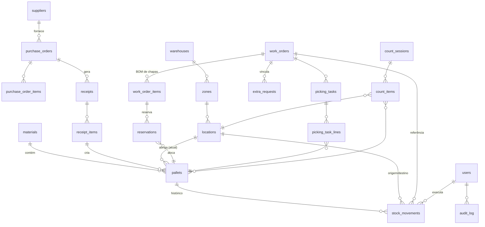

# 04 — Modelo de Dados

PostgreSQL 16. Convenções: `snake_case`, PK `uuid` (v7, ordenável por tempo), `created_at/updated_at timestamptz` em toda tabela, soft-delete apenas em cadastros (`deleted_at`), **nunca** em movimentos.

## 1. Diagrama ER (essencial)



## 2. DDL — Catálogo e layout

```sql
CREATE TABLE materials (
    id              uuid PRIMARY KEY,
    sku             text NOT NULL UNIQUE,          -- ex.: MDF-BCO-TX-18-2750X1850
    description     text NOT NULL,                 -- "MDF Branco TX 18mm 2750×1850"
    category        text NOT NULL,                 -- MDF | MDP | COMPENSADO | FORMICA | FITA
    thickness_mm    numeric(6,2),
    width_mm        integer,
    length_mm       integer,
    color_code      text,                          -- código de cor do fornecedor
    finish          text,                          -- TX, Ultra, etc.
    unit            text NOT NULL DEFAULT 'CHAPA',
    weight_kg_unit  numeric(8,3),                  -- peso por chapa (p/ restrições de endereço)
    default_supplier_id uuid REFERENCES suppliers(id),
    min_stock_units integer,                       -- fallback quando IA indisponível
    abc_class       char(1),                       -- recalculada por job (doc 07)
    active          boolean NOT NULL DEFAULT true,
    created_at      timestamptz NOT NULL DEFAULT now(),
    updated_at      timestamptz NOT NULL DEFAULT now(),
    deleted_at      timestamptz
);

CREATE TABLE suppliers (
    id uuid PRIMARY KEY, name text NOT NULL, cnpj text UNIQUE,
    lead_time_days integer,                        -- usado na previsão de ruptura
    created_at timestamptz NOT NULL DEFAULT now(), updated_at timestamptz NOT NULL DEFAULT now()
);

CREATE TABLE warehouses (
    id uuid PRIMARY KEY, code text NOT NULL UNIQUE, name text NOT NULL,
    created_at timestamptz NOT NULL DEFAULT now(), updated_at timestamptz NOT NULL DEFAULT now()
);

CREATE TABLE zones (
    id uuid PRIMARY KEY,
    warehouse_id uuid NOT NULL REFERENCES warehouses(id),
    code text NOT NULL,                            -- ESTOCAGEM, DOCA, QUARENTENA, PICKING-RAPIDO...
    kind text NOT NULL CHECK (kind IN ('STORAGE','DOCK','QUARANTINE','FAST_PICK','OVERFLOW','VIRTUAL')),
    UNIQUE (warehouse_id, code)
);

CREATE TABLE locations (
    id              uuid PRIMARY KEY,
    zone_id         uuid NOT NULL REFERENCES zones(id),
    code            text NOT NULL UNIQUE,          -- A-03-N0 (etiqueta física)
    aisle           text, bay text, level smallint,
    x_m             numeric(7,2), y_m numeric(7,2),-- coordenadas na planta
    capacity_pallets smallint NOT NULL DEFAULT 1,
    max_weight_kg   integer,
    max_height_mm   integer,
    status          text NOT NULL DEFAULT 'ACTIVE'
                    CHECK (status IN ('ACTIVE','BLOCKED','MAINTENANCE','RETIRED')),
    is_virtual      boolean NOT NULL DEFAULT false,-- DOCA-01, GARFO-EMP01, PROD-SECC
    created_at timestamptz NOT NULL DEFAULT now(), updated_at timestamptz NOT NULL DEFAULT now()
);

CREATE TABLE layout_versions (
    id uuid PRIMARY KEY,
    warehouse_id uuid NOT NULL REFERENCES warehouses(id),
    version integer NOT NULL,
    layout_json jsonb NOT NULL,                    -- doc 03 §2
    distance_matrix bytea,                         -- matriz compactada pré-computada
    published_at timestamptz,
    published_by uuid REFERENCES users(id),
    UNIQUE (warehouse_id, version)
);
```

## 3. DDL — Entrada (compras e recebimento)

```sql
CREATE TABLE purchase_orders (
    id uuid PRIMARY KEY,
    po_number text NOT NULL UNIQUE,                -- vindo do ERP ou manual
    supplier_id uuid NOT NULL REFERENCES suppliers(id),
    status text NOT NULL DEFAULT 'OPEN' CHECK (status IN ('OPEN','PARTIAL','CLOSED','CANCELLED')),
    expected_at date,
    source text NOT NULL DEFAULT 'ERP' CHECK (source IN ('ERP','MANUAL','CSV')),
    created_at timestamptz NOT NULL DEFAULT now(), updated_at timestamptz NOT NULL DEFAULT now()
);

CREATE TABLE purchase_order_items (
    id uuid PRIMARY KEY,
    purchase_order_id uuid NOT NULL REFERENCES purchase_orders(id),
    material_id uuid NOT NULL REFERENCES materials(id),
    qty_ordered integer NOT NULL CHECK (qty_ordered > 0),
    qty_received integer NOT NULL DEFAULT 0,
    unit_cost numeric(12,4)
);

CREATE TABLE receipts (
    id uuid PRIMARY KEY,
    purchase_order_id uuid REFERENCES purchase_orders(id),
    nfe_key text,                                  -- chave da NF-e (44 dígitos)
    status text NOT NULL DEFAULT 'IN_PROGRESS'
           CHECK (status IN ('IN_PROGRESS','COMPLETED','COMPLETED_WITH_ISSUES','CANCELLED')),
    received_by uuid NOT NULL REFERENCES users(id),
    started_at timestamptz NOT NULL DEFAULT now(),
    completed_at timestamptz
);

CREATE TABLE receipt_items (
    id uuid PRIMARY KEY,
    receipt_id uuid NOT NULL REFERENCES receipts(id),
    material_id uuid NOT NULL REFERENCES materials(id),
    qty_expected integer,
    qty_received integer NOT NULL DEFAULT 0,
    qty_damaged integer NOT NULL DEFAULT 0,
    supplier_batch text,                           -- lote do fornecedor
    issue_notes text,
    issue_photos jsonb                             -- URLs de fotos de avaria
);
```

## 4. DDL — Estoque (pallets e ledger)

```sql
CREATE TABLE pallets (
    id              uuid PRIMARY KEY,
    label_code      text NOT NULL UNIQUE,          -- PLT-004217 (conteúdo do QR)
    material_id     uuid NOT NULL REFERENCES materials(id),
    receipt_item_id uuid REFERENCES receipt_items(id),
    supplier_batch  text,
    qty_units       integer NOT NULL CHECK (qty_units >= 0),   -- saldo atual (projeção)
    qty_initial     integer NOT NULL,
    weight_kg       numeric(8,2),                  -- calculado: qty × peso unitário + tara
    height_mm       integer,
    status          text NOT NULL DEFAULT 'RECEIVED'
                    CHECK (status IN ('RECEIVED','STORED','IN_TRANSIT','PICKING',
                                      'IN_PRODUCTION','QUARANTINE','CONSUMED','DISCARDED')),
    location_id     uuid REFERENCES locations(id), -- projeção da posição atual
    fifo_date       date NOT NULL,                 -- data-base para FIFO (data de recebimento)
    created_at timestamptz NOT NULL DEFAULT now(), updated_at timestamptz NOT NULL DEFAULT now()
);
CREATE INDEX ix_pallets_material_status ON pallets (material_id, status);
CREATE INDEX ix_pallets_location ON pallets (location_id) WHERE location_id IS NOT NULL;

-- ===== LEDGER IMUTÁVEL — fonte da verdade =====
CREATE TABLE stock_movements (
    id              uuid PRIMARY KEY,              -- uuid v7 (ordenável)
    seq             bigint GENERATED ALWAYS AS IDENTITY,  -- ordem total no servidor
    type            text NOT NULL CHECK (type IN
                    ('RECEBIMENTO','GUARDA','TRANSFERENCIA','SAIDA_PRODUCAO','DEVOLUCAO',
                     'AJUSTE_INVENTARIO','QUARENTENA','DESCARTE','ESTORNO')),
    pallet_id       uuid NOT NULL REFERENCES pallets(id),
    material_id     uuid NOT NULL REFERENCES materials(id),   -- desnormalizado p/ consulta
    qty_delta       integer NOT NULL,              -- + entrada, − saída, 0 = só localização
    from_location_id uuid REFERENCES locations(id),
    to_location_id   uuid REFERENCES locations(id),
    work_order_id   uuid REFERENCES work_orders(id),  -- OBRIGATÓRIO p/ SAIDA_PRODUCAO e DEVOLUCAO (trigger)
    extra_request_id uuid REFERENCES extra_requests(id),
    receipt_id      uuid REFERENCES receipts(id),
    count_session_id uuid REFERENCES count_sessions(id),
    reversed_movement_id uuid REFERENCES stock_movements(id), -- p/ ESTORNO
    reason_code     text,                          -- p/ exceções e ajustes
    performed_by    uuid NOT NULL REFERENCES users(id),
    device_id       text,                          -- iPad/empilhadeira
    idempotency_key uuid NOT NULL UNIQUE,          -- dedupe da fila offline
    client_ts       timestamptz,                   -- hora no dispositivo
    server_ts       timestamptz NOT NULL DEFAULT now()
);
CREATE INDEX ix_mov_pallet ON stock_movements (pallet_id, seq);
CREATE INDEX ix_mov_wo ON stock_movements (work_order_id) WHERE work_order_id IS NOT NULL;
CREATE INDEX ix_mov_type_ts ON stock_movements (type, server_ts);

-- Imutabilidade garantida no banco:
CREATE RULE stock_movements_no_update AS ON UPDATE TO stock_movements DO INSTEAD NOTHING;
CREATE RULE stock_movements_no_delete AS ON DELETE TO stock_movements DO INSTEAD NOTHING;

-- Regra de ouro RN-04 no banco:
CREATE FUNCTION enforce_wo_on_outbound() RETURNS trigger AS $$
BEGIN
  IF NEW.type IN ('SAIDA_PRODUCAO','DEVOLUCAO') AND NEW.work_order_id IS NULL THEN
    RAISE EXCEPTION 'Movimento % exige work_order_id', NEW.type;
  END IF;
  RETURN NEW;
END $$ LANGUAGE plpgsql;
CREATE TRIGGER trg_wo_outbound BEFORE INSERT ON stock_movements
  FOR EACH ROW EXECUTE FUNCTION enforce_wo_on_outbound();
```

## 5. DDL — Saída (Work Orders, picking, extras, devolução)

```sql
CREATE TABLE work_orders (
    id uuid PRIMARY KEY,
    wo_number text NOT NULL UNIQUE,                -- QR impresso na ordem de corte
    project_ref text,                              -- projeto/cliente no ERP
    status text NOT NULL DEFAULT 'RELEASED'
           CHECK (status IN ('RELEASED','ALLOCATED','PICKING','PICKED','PARTIAL',
                             'IN_PRODUCTION','COMPLETED','CANCELLED')),
    priority smallint NOT NULL DEFAULT 5,          -- 1 = mais urgente
    due_date date,
    source text NOT NULL DEFAULT 'ERP',
    created_at timestamptz NOT NULL DEFAULT now(), updated_at timestamptz NOT NULL DEFAULT now()
);

CREATE TABLE work_order_items (
    id uuid PRIMARY KEY,
    work_order_id uuid NOT NULL REFERENCES work_orders(id),
    material_id uuid NOT NULL REFERENCES materials(id),
    qty_required integer NOT NULL CHECK (qty_required > 0),
    qty_picked integer NOT NULL DEFAULT 0,
    qty_returned integer NOT NULL DEFAULT 0
);

-- Reserva: liga demanda (WO item) a oferta (pallet), criada na liberação da WO
CREATE TABLE reservations (
    id uuid PRIMARY KEY,
    work_order_item_id uuid NOT NULL REFERENCES work_order_items(id),
    pallet_id uuid NOT NULL REFERENCES pallets(id),
    qty integer NOT NULL CHECK (qty > 0),
    status text NOT NULL DEFAULT 'ACTIVE' CHECK (status IN ('ACTIVE','FULFILLED','RELEASED','EXPIRED')),
    created_at timestamptz NOT NULL DEFAULT now()
);
CREATE INDEX ix_res_pallet_active ON reservations (pallet_id) WHERE status = 'ACTIVE';

CREATE TABLE picking_tasks (
    id uuid PRIMARY KEY,
    work_order_id uuid NOT NULL REFERENCES work_orders(id),
    extra_request_id uuid REFERENCES extra_requests(id),  -- quando origem é pedido extra
    status text NOT NULL DEFAULT 'PENDING'
           CHECK (status IN ('PENDING','ASSIGNED','IN_PROGRESS','DONE','PARTIAL','CANCELLED')),
    assigned_to uuid REFERENCES users(id),
    route_json jsonb,                              -- sequência otimizada [{line_id, order}]
    started_at timestamptz, finished_at timestamptz,
    created_at timestamptz NOT NULL DEFAULT now()
);

CREATE TABLE picking_task_lines (
    id uuid PRIMARY KEY,
    picking_task_id uuid NOT NULL REFERENCES picking_tasks(id),
    reservation_id uuid NOT NULL REFERENCES reservations(id),
    pallet_id uuid NOT NULL REFERENCES pallets(id),
    location_id uuid NOT NULL REFERENCES locations(id),  -- onde o pallet estava ao alocar
    qty_planned integer NOT NULL,
    qty_confirmed integer,
    status text NOT NULL DEFAULT 'PENDING'
           CHECK (status IN ('PENDING','SCANNED','CONFIRMED','SKIPPED','REALLOCATED')),
    exception_code text,                           -- FIFO_OVERRIDE, PALLET_MISSING, QTY_SHORT...
    scanned_at timestamptz, confirmed_at timestamptz
);

-- Pedido extra: SEMPRE pendurado numa WO (RN-04)
CREATE TABLE extra_requests (
    id uuid PRIMARY KEY,
    work_order_id uuid NOT NULL REFERENCES work_orders(id),
    material_id uuid NOT NULL REFERENCES materials(id),
    qty integer NOT NULL CHECK (qty > 0),
    reason_code text NOT NULL CHECK (reason_code IN
        ('ERRO_CORTE','AVARIA_PROCESSO','QUALIDADE_MATERIAL','AJUSTE_PROJETO','OUTRO')),
    reason_text text,                              -- obrigatório se OUTRO (validação de app)
    status text NOT NULL DEFAULT 'PENDING_APPROVAL'
           CHECK (status IN ('PENDING_APPROVAL','APPROVED','REJECTED','FULFILLED','CANCELLED')),
    requested_by uuid NOT NULL REFERENCES users(id),
    approved_by uuid REFERENCES users(id),
    approved_at timestamptz,
    created_at timestamptz NOT NULL DEFAULT now()
);

CREATE TABLE returns (
    id uuid PRIMARY KEY,
    work_order_id uuid NOT NULL REFERENCES work_orders(id),
    pallet_id uuid NOT NULL REFERENCES pallets(id),
    qty integer NOT NULL CHECK (qty > 0),
    condition text NOT NULL CHECK (condition IN ('INTEGRO','AVARIADO')),
    performed_by uuid NOT NULL REFERENCES users(id),
    created_at timestamptz NOT NULL DEFAULT now()
);
```

## 6. DDL — Inventário, auditoria, IAM

```sql
CREATE TABLE count_sessions (
    id uuid PRIMARY KEY,
    kind text NOT NULL CHECK (kind IN ('CYCLE','FULL')),
    zone_id uuid REFERENCES zones(id),             -- FULL congela a zona
    status text NOT NULL DEFAULT 'OPEN' CHECK (status IN ('OPEN','REVIEW','CLOSED','CANCELLED')),
    generated_by text NOT NULL DEFAULT 'SCHEDULER',-- SCHEDULER | ANOMALY_AI | MANUAL
    created_at timestamptz NOT NULL DEFAULT now(), closed_at timestamptz
);

CREATE TABLE count_items (
    id uuid PRIMARY KEY,
    count_session_id uuid NOT NULL REFERENCES count_sessions(id),
    location_id uuid NOT NULL REFERENCES locations(id),
    expected_pallet_id uuid REFERENCES pallets(id),
    expected_qty integer,
    found_pallet_id uuid REFERENCES pallets(id),
    found_qty integer,
    count_round smallint NOT NULL DEFAULT 1,       -- 2 = recontagem cega
    counted_by uuid REFERENCES users(id),
    counted_at timestamptz,
    resolution text CHECK (resolution IN ('MATCH','ADJUSTED','RECOUNT','PENDING')),
    adjustment_movement_id uuid REFERENCES stock_movements(id),
    approved_by uuid REFERENCES users(id)
);

CREATE TABLE users (
    id uuid PRIMARY KEY,
    name text NOT NULL,
    badge_code text UNIQUE,                        -- QR do crachá
    pin_hash text,                                 -- PIN de 4-6 dígitos (argon2)
    email text UNIQUE,                             -- login web (supervisores)
    role text NOT NULL CHECK (role IN ('OPERATOR','RECEIVER','SUPERVISOR','PLANNER','BUYER','ADMIN')),
    active boolean NOT NULL DEFAULT true,
    created_at timestamptz NOT NULL DEFAULT now(), updated_at timestamptz NOT NULL DEFAULT now()
);

-- Auditoria de sistema (além do ledger de estoque): cadastros, aprovações, logins, overrides
CREATE TABLE audit_log (
    id uuid PRIMARY KEY,
    actor_id uuid REFERENCES users(id),
    action text NOT NULL,                          -- 'material.update', 'extra_request.approve'...
    entity_type text NOT NULL, entity_id uuid,
    before jsonb, after jsonb,
    ip inet, device_id text,
    created_at timestamptz NOT NULL DEFAULT now()
);
```

## 7. Tabelas do serviço de IA

```sql
CREATE TABLE ai_stockout_forecasts (
    id uuid PRIMARY KEY,
    material_id uuid NOT NULL REFERENCES materials(id),
    run_at timestamptz NOT NULL,
    horizon_days integer NOT NULL,
    predicted_stockout_date date,                  -- NULL = sem ruptura no horizonte
    days_of_cover numeric(6,1),
    confidence numeric(4,3),
    recommended_order_qty integer,
    features jsonb                                 -- explicabilidade (consumo médio, WOs futuras...)
);

CREATE TABLE ai_anomaly_alerts (
    id uuid PRIMARY KEY,
    kind text NOT NULL,                            -- SHRINKAGE, ODD_MOVEMENT, COUNT_DRIFT, EXTRA_ABUSE...
    severity text NOT NULL CHECK (severity IN ('INFO','WARNING','CRITICAL')),
    entity_type text, entity_id uuid,
    score numeric(6,4),
    explanation text,                              -- texto legível gerado junto do score
    status text NOT NULL DEFAULT 'OPEN' CHECK (status IN ('OPEN','ACK','RESOLVED','FALSE_POSITIVE')),
    created_at timestamptz NOT NULL DEFAULT now()
);

CREATE TABLE ai_slotting_suggestions (
    id uuid PRIMARY KEY,
    pallet_id uuid REFERENCES pallets(id),         -- sugestão pontual (putaway)
    material_id uuid REFERENCES materials(id),     -- ou sugestão de re-slotting em massa
    suggested_location_id uuid REFERENCES locations(id),
    expected_gain text,                            -- "−18% distância de picking no mix atual"
    status text NOT NULL DEFAULT 'PROPOSED' CHECK (status IN ('PROPOSED','ACCEPTED','OVERRIDDEN','EXPIRED')),
    created_at timestamptz NOT NULL DEFAULT now()
);
```

## 8. Invariantes e consistência

1. `pallets.qty_units` = `qty_initial + Σ qty_delta` dos movimentos do pallet — verificado por job noturno de reconciliação; divergência = bug, alerta crítico.
2. `pallets.location_id` = `to_location_id` do último movimento de localização do pallet.
3. `work_order_items.qty_picked` = Σ `SAIDA_PRODUCAO` − Σ `DEVOLUCAO` do item.
4. Um pallet com reserva `ACTIVE` não pode ser alvo de `TRANSFERENCIA` para fora da zona sem realocar a reserva (validação de serviço).
5. Saldo disponível de material = Σ `qty_units` de pallets `STORED` − Σ reservas `ACTIVE`.
