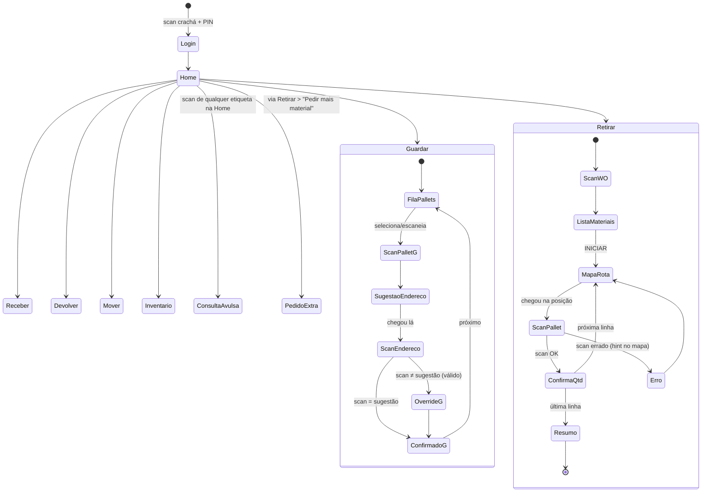
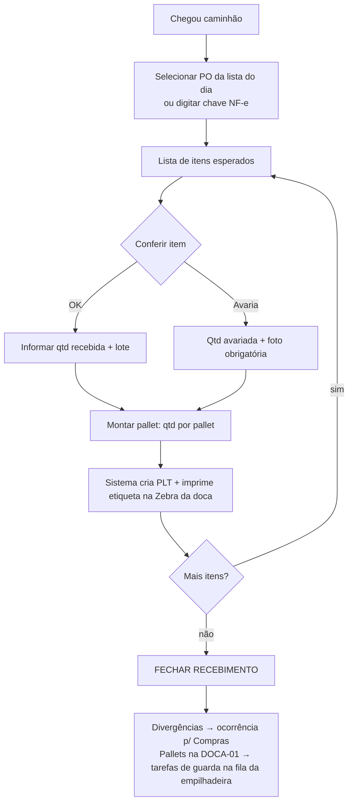

# 06 — Telas e Fluxos de Navegação

## 1. Design system "chão de fábrica"

| Token | Valor | Motivo |
|---|---|---|
| Alvo de toque primário | ≥ 80×80 pt | Luva, empilhadeira vibrando |
| Alvo secundário | ≥ 56 pt | — |
| Fonte corpo / título | 22 pt / 34 pt, peso 600+ | Leitura a um braço de distância |
| Contraste | ≥ 7:1 (AAA) | Galpão com luz mista |
| Cores de estado | 🟩 verde = confirmado · 🟨 âmbar = atenção/override · 🟥 vermelho = bloqueio · 🟦 azul = informação/navegação | Semáforo universal; nunca cor como único sinal (sempre ícone + texto) |
| Feedback de scan | ≤ 200 ms: flash de borda + som + vibração | O operador não olha para a tela ao escanear |
| Orientação | Paisagem travada (iPad no suporte da empilhadeira) | — |
| Zona de ação | Botões primários na metade direita (iPad à direita do volante); espelhável por configuração | Alcance do polegar |
| Estados vazios/erro | Sempre dizem **o que fazer**, nunca só o que houve | — |

Componentes-chave: `BigButton`, `ScanPanel` (área de scan sempre ativa — scanner BT digita nela sem foco), `StepHeader` (passo X de Y + botão sair), `MapView` (SVG pan/zoom), `QtyStepper` (− / número gigante / +), `TaskCard`.

## 2. Mapa de navegação (PWA operador)



## 3. Telas do operador (wireframes)

### 3.1 Home

```
┌────────────────────────────────────────────────────────────────┐
│  👤 Carlos Silva · EMP-01          Wi-Fi ●    🔔 2 tarefas     │
├────────────────────────────────────────────────────────────────┤
│                                                                │
│   ┌──────────────┐   ┌──────────────┐   ┌──────────────┐      │
│   │   📦  (3)    │   │   🏗️  (2)    │   │      🔍       │      │
│   │   GUARDAR    │   │   RETIRAR    │   │   CONSULTAR  │      │
│   └──────────────┘   └──────────────┘   └──────────────┘      │
│   ┌──────────────┐   ┌──────────────┐   ┌──────────────┐      │
│   │      ↩️       │   │      🔄      │   │   📋  (5)    │      │
│   │   DEVOLVER   │   │    MOVER     │   │  INVENTÁRIO  │      │
│   └──────────────┘   └──────────────┘   └──────────────┘      │
│                                                                │
│  ▸ Escaneie qualquer etiqueta a qualquer momento para consultar │
└────────────────────────────────────────────────────────────────┘
```

- Badges numéricos = tarefas pendentes por tipo. Sem tarefas, botão fica cinza-claro mas ativo.
- `RECEBER` aparece só para papel `RECEIVER` (tablet da doca) — a Home é sensível ao papel.
- Scan de qualquer etiqueta na Home abre a **consulta avulsa** (ficha do pallet/endereço + ações contextuais: "Mover", "Ver histórico").

### 3.2 Retirada — scan da WO

```
┌────────────────────────────────────────────────────────────────┐
│  ← Sair                    RETIRAR                  Passo 1/4  │
├────────────────────────────────────────────────────────────────┤
│                                                                │
│              ┌────────────────────────────┐                    │
│              │                            │                    │
│              │      📷  APONTE PARA O     │                    │
│              │      QR DA ORDEM (WO)      │                    │
│              │                            │                    │
│              └────────────────────────────┘                    │
│                                                                │
│                  [ Não consigo escanear ]                      │
└────────────────────────────────────────────────────────────────┘
```

### 3.3 Retirada — lista de materiais

```
┌────────────────────────────────────────────────────────────────┐
│  ← Sair       WO-8841 · Cozinha Fam. Souza          Passo 2/4  │
├────────────────────────────────────────────────────────────────┤
│  ✅ MDF Branco TX 18mm          4 chapas   B-02 · PLT-004102   │
│  ⬜ MDF Carvalho 18mm           6 chapas   C-07 · PLT-004217   │
│  ⬜ MDF Branco TX 15mm          2 chapas   A-01 · PLT-003990   │
│  🟥 Fórmica Preta 0.8mm  EM FALTA — aviso enviado ao PCP       │
├────────────────────────────────────────────────────────────────┤
│      [ + PEDIR MAIS MATERIAL ]        [ ▶ INICIAR ROTA ]       │
└────────────────────────────────────────────────────────────────┘
```

- Item em falta **não bloqueia** os demais; WO fechará como `PARCIAL` com pendência explícita.
- `+ PEDIR MAIS MATERIAL` abre o fluxo de **pedido extra já vinculado à WO-8841** (RN-04): escolhe material (busca grande com foto/cor), quantidade no stepper, motivo em 5 botões — 3 toques no caminho feliz.

### 3.4 Retirada — mapa com rota (a tela principal do sistema)

```
┌────────────────────────────────────────────────────────────────┐
│  ← WO-8841                 2 de 3 · MDF Carvalho 18mm · 6 chp  │
├───────────────────────────────────────────────┬────────────────┤
│  ┌─────────────────────────────────────────┐  │  PRÓXIMO:      │
│  │  DOCA   RUA A    RUA B    RUA C         │  │                │
│  │   ▣     ░░░░░    ░░✅░░   ░░░░░         │  │   C-07-N0      │
│  │   │                        ┌─(2)◉      │  │   ─────────    │
│  │   └────────═══════════════┘   pulsando │  │  PLT-004217    │
│  │        rota ═══                         │  │  Carvalho 18   │
│  │                              SECC ▣     │  │  retirar 6     │
│  │  🧭 você: fim da rua B                  │  │                │
│  └─────────────────────────────────────────┘  │ [📷 ESCANEAR   │
│     pinça para zoom · toque para detalhes     │    PALLET]     │
├───────────────────────────────────────────────┴────────────────┤
│  [ ⚠ PROBLEMA NA POSIÇÃO ]                                     │
└────────────────────────────────────────────────────────────────┘
```

- Pallets da WO destacados com número da sequência; alvo atual pulsa; rota desenhada nos corredores.
- `⚠ PROBLEMA NA POSIÇÃO` → 3 botões: `PALLET NÃO ESTÁ AQUI` (dispara exceção + recontagem + realoca outro pallet na hora), `ACESSO BLOQUEADO` (re-sequencia a rota), `PALLET AVARIADO` (quarentena + realoca).

### 3.5 Retirada — confirmação de quantidade

```
┌────────────────────────────────────────────────────────────────┐
│  ✅ PLT-004217 · MDF Carvalho 18mm · saldo 42                  │
├────────────────────────────────────────────────────────────────┤
│                 Quantas chapas você retirou?                   │
│                                                                │
│           ┌─────┐      ┌─────────┐      ┌─────┐               │
│           │  −  │      │    6    │      │  +  │               │
│           └─────┘      └─────────┘      └─────┘               │
│                     (pedido: 6 chapas)                         │
│                                                                │
│               [ ✔ CONFIRMAR RETIRADA ]                        │
└────────────────────────────────────────────────────────────────┘
```

- Default = quantidade pedida → caminho feliz é **1 toque**. Ao confirmar: banner verde "Estoque atualizado · saldo do pallet: 36", som de sucesso, e o mapa já mostra o próximo alvo.
- Quantidade ≠ pedida → pede motivo em 1 toque (`PALLET COM MENOS`, `CHAPA AVARIADA`, `OUTRO`).

### 3.6 Guarda — sugestão de endereço

```
┌────────────────────────────────────────────────────────────────┐
│  ← Fila             GUARDAR PLT-004350              Passo 2/3  │
├────────────────────────────────────────────────────────────────┤
│   MDF Branco TX 18mm · 48 chapas · recebido hoje 14:20         │
│                                                                │
│                 LEVE PARA:    ▛▀▀▀▀▀▀▀▜                        │
│                               ▌ B-04  ▐     nível: CHÃO       │
│                               ▙▄▄▄▄▄▄▄▟                        │
│   [mini-mapa com rota da doca até B-04, posição pulsando]      │
│                                                                │
│   ℹ Perto dos outros 3 pallets de Branco TX 18                 │
│                                                                │
│          Ao chegar, ESCANEIE A ETIQUETA DA POSIÇÃO             │
│                  [ Guardar em outro lugar ]                    │
└────────────────────────────────────────────────────────────────┘
```

- Scan da posição = confirmação (zero toques no caminho feliz).
- Scan de outra posição válida → âmbar: "B-06 também serve. Confirmar aqui?" `[SIM]` — override registrado.

### 3.7 Inventário cíclico — contagem

```
┌────────────────────────────────────────────────────────────────┐
│  ← Sair            CONTAGEM · 2 de 5                           │
├────────────────────────────────────────────────────────────────┤
│   Vá até  A-09-N1  e escaneie a etiqueta da POSIÇÃO            │
│   ································································ │
│   Posição OK ✅ → agora escaneie o(s) PALLET(s) da posição      │
│   PLT-003812 ✅  MDF Cinza 15mm                                 │
│              Quantas chapas?   [−]  [ 17 ]  [+]                │
│              (sistema esperava: não te contamos 😉 — contagem cega)│
│                                    [ ✔ CONFIRMAR ]            │
└────────────────────────────────────────────────────────────────┘
```

- Contagem **cega** (não mostra o esperado) para não enviesar. Divergência → recontagem por outro operador antes de propor ajuste.

## 4. Fluxo de recebimento (tablet da doca)



## 5. Painel web (supervisor / PCP / compras)

Telas desktop (não precisam da estética de botões gigantes, mas seguem a mesma linguagem):

1. **Torre de controle** — mapa vivo do armazém (ocupação em tempo real), fila de tarefas por operador, WOs em separação com barra de progresso, alertas (extras pendentes de aprovação, anomalias críticas, rupturas previstas).
2. **Work Orders** — lista/kanban por status; detalhe com cobertura de material, linha do tempo de picking, extras e devoluções da ordem (custo real de material por projeto).
3. **Estoque** — por material: saldo, reservas, cobertura em dias (IA), pallets e posições; por endereço: utilização, mapa de calor de giro.
4. **Inventário** — programação cíclica, divergências, aprovação de ajustes com dupla contagem lado a lado.
5. **Auditoria** — busca no ledger por pallet/WO/usuário/período; linha do tempo visual; exportação CSV.
6. **Aprovações** — pedidos extras (com motivo, foto, histórico de extras do solicitante) — aprovar/rejeitar em 1 clique, também via notificação push.
7. **Dashboards inteligentes** (doc 07 §6) — KPIs + narrativa da IA + pergunta em linguagem natural.
8. **Cadastros/Admin** — materiais, fornecedores, usuários/crachás, editor visual da planta baixa, parâmetros (pesos do slotting, limite de aprovação de extra, tolerância de inventário).

## 6. Notificações

| Evento | Quem recebe | Canal |
|---|---|---|
| Pedido extra aguardando aprovação | Supervisor | Push (PWA) + painel |
| Ruptura prevista ≤ lead time do fornecedor | Comprador + PCP | E-mail + painel |
| Divergência de inventário acima do limite | Supervisor | Painel + push |
| Anomalia crítica (doc 07) | Supervisor | Push imediato |
| WO separada (pronta para corte) | PCP | Painel/WebSocket |
| Fila offline de um iPad > 15 min | TI/Admin | E-mail |
